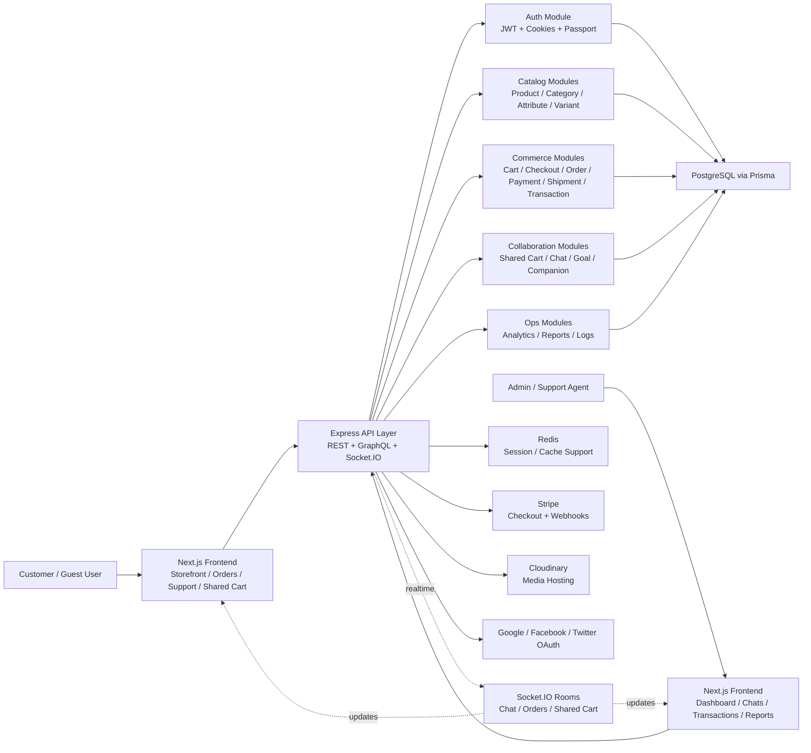

# Full Stack Ecommerce Platform Project Report

## Abstract

This project is a full-stack ecommerce platform designed to support modern online shopping, real-time customer interaction, collaborative buying, guided product discovery, and post-purchase engagement. The system provides a customer storefront, an administrative dashboard, live support chat, goal-based product recommendations, shared carts, checkout recovery, order tracking, analytics, and reporting. The frontend is built with Next.js, React, TypeScript, Tailwind CSS, Redux Toolkit, and Apollo Client, while the backend is built with Node.js, Express, TypeScript, Prisma ORM, PostgreSQL, Redis, Socket.IO, and Stripe. The application is designed as a modular commerce system rather than a basic catalog-and-checkout website. It combines transactional ecommerce features with collaboration, guidance, analytics, and customer retention workflows.

## 1. Introduction

Ecommerce systems today are expected to do more than display products and collect payments. Customers expect guided shopping, real-time support, transparent order progress, personalized post-purchase help, and collaborative decision-making. Businesses also need structured catalog management, analytics, operational dashboards, logging, and customer-support workflows.

This project addresses those requirements by building a complete ecommerce platform with:

- a public storefront for browsing and shopping
- authenticated user flows for cart, checkout, orders, and profile management
- an administrative dashboard for catalog, inventory, reports, transactions, users, and logs
- real-time chat and collaboration using Socket.IO
- post-purchase companion and goal-success tracking features

The project is organized into a frontend application under `src/client` and a backend application under `src/server`.

## 2. Problem Statement

Many normal ecommerce applications focus only on product listing, cart management, and payment completion. They often do not support:

- collaborative cart planning
- guided shopping for a user outcome or goal
- proactive checkout recovery
- rich post-purchase support flows
- integrated live support communication
- meaningful order progress visibility

This project aims to solve those limitations by building an ecommerce platform that supports both transactional commerce and richer customer journeys.

## 3. Objectives

The main objectives of the project are:

- to build a scalable full-stack ecommerce web application
- to provide a modern storefront with product browsing, filtering, reviews, cart, and checkout
- to create an admin dashboard for managing products, categories, attributes, inventory, users, and reports
- to integrate secure payment processing through Stripe
- to support live communication between users and support/admin through chat and WebRTC signaling
- to enable collaborative shopping through shared carts
- to enable guided bundle generation through goal-based shopping templates
- to support post-purchase engagement using order companion and goal-success tracking
- to provide real-time order-progress visibility

## 4. Project Scope

The system covers the following functional areas:

- customer storefront
- authentication and authorization
- product and category management
- attribute and variant management
- cart and checkout
- orders, shipments, payments, and transactions
- shared cart collaboration
- goal-based bundle generation
- support chat and call signaling
- analytics and reporting
- operational logs
- order tracking and post-purchase support

## 5. System Overview

At a high level, the application works as follows:

1. Customers browse products through the Next.js frontend.
2. Product, cart, and order data are fetched from backend REST and GraphQL APIs.
3. The Express backend handles business rules for catalog, orders, checkout, shared carts, goals, support, and analytics.
4. Prisma ORM maps backend logic to the PostgreSQL database.
5. Redis supports runtime infrastructure such as session storage and caching behavior.
6. Socket.IO enables real-time features like support chat, shared-cart activity, and user order updates.
7. Stripe is used for payment checkout and webhook-driven payment completion logic.

## 6. Architecture Diagram

## 7. Frontend Architecture

The frontend is implemented with Next.js App Router and TypeScript. It is responsible for:

- rendering public pages such as home, shop, product details, cart, shipping, returns, goals, and track-order
- rendering private pages such as profile, support, user orders, and dashboard pages
- calling REST APIs using RTK Query
- calling GraphQL APIs using Apollo Client
- handling live events using Socket.IO client
- managing forms and validation using React Hook Form and Zod

### Major frontend areas

- `src/client/app/(public)` for public storefront and support pages
- `src/client/app/(private)` for authenticated user and dashboard pages
- `src/client/app/store/apis` for RTK Query API slices
- `src/client/app/components` for reusable UI components
- `src/client/app/lib/constants` for shared configuration like API and socket URLs

## 8. Backend Architecture

The backend is built with Express and modular domain-based services. Each major business area is separated into repository, service, controller, and route layers.

### Backend layers

- `routes`: request entry points
- `controller`: HTTP request/response handling
- `service`: business logic
- `repository` or direct Prisma access: database communication
- `infra`: database, cache, logging, payment, and socket setup

### Main backend modules

- `auth`
- `user`
- `product`
- `category`
- `attribute`
- `variant`
- `cart`
- `checkout`
- `order`
- `payment`
- `shipment`
- `transaction`
- `review`
- `chat`
- `goal`
- `shared-cart`
- `analytics`
- `reports`
- `logs`
- `section`
- `address`
- `webhook`

This modular structure keeps the application maintainable and allows new business features to be added with less coupling.

## 9. Database Design Summary

The database uses PostgreSQL with Prisma as the ORM. The schema is largely relational and organized around core commerce entities.

### Key core models

- `User`
- `Product`
- `ProductVariant`
- `Category`
- `Attribute`
- `AttributeValue`
- `Cart`
- `CartItem`
- `Order`
- `OrderItem`
- `Payment`
- `Shipment`
- `Transaction`
- `Address`
- `Chat`
- `ChatMessage`
- `GoalTemplate`
- `GoalBundle`
- `SharedCart`
- `SharedCartMember`
- `SharedCartVote`
- `SharedCartNote`

### Key data principles followed

- relational linking using foreign-key style Prisma relations
- uniqueness enforcement through `@unique` and `@@unique`
- enum-driven state management for statuses
- transactions for critical flows such as checkout and order creation
- practical denormalization where business history matters, such as order item price snapshots and aggregate product metrics

## 10. Major Functional Modules

### 10.1 Customer Storefront

The storefront allows users to:

- browse catalog items
- search and filter products
- view variants, price, images, and reviews
- add items to cart
- move through checkout
- access track-order, shipping, returns, and size-guide support pages

### 10.2 Authentication

The authentication module supports:

- sign up
- sign in
- sign out
- refresh token handling
- forgot password
- reset password
- Google login
- Facebook login
- Twitter login

Role-based access is implemented using:

- `USER`
- `ADMIN`
- `SUPERADMIN`

### 10.3 Product Catalog and Inventory

The platform supports:

- product CRUD
- category management
- attribute and attribute value definitions
- variant combinations
- stock and restock tracking
- review aggregation
- featured and promotional sections

### 10.4 Cart and Checkout

The commerce flow includes:

- persistent carts
- quantity updates
- Stripe session creation
- checkout attempts
- checkout failure and cancellation tracking
- checkout recovery records
- development fallback checkout flow
- support handoff during failed checkout

### 10.5 Orders and Post-Purchase Features

After checkout, the system supports:

- order creation
- payment storage
- shipment storage
- transaction status updates
- order reminders
- order companion content
- goal-success check-ins
- support handoff linked to orders
- order tracking timeline and progress

### 10.6 Shared Cart Collaboration

The shared cart feature is one of the project's unique differentiators. It allows:

- cart sharing through a short code
- guest or logged-in collaborator participation
- live item quantity changes
- voting on items
- collaborative notes
- live participant presence updates

### 10.7 Goal-Based Shopping

The goal module helps users shop by outcome instead of product-only browsing. It supports:

- predefined goal templates
- step-wise bundle assembly
- category and keyword matching
- budget-weight allocation
- suggested bundle generation from in-stock variants

### 10.8 Support, Chat, and Communication

The support module includes:

- chat between customer and admin/support
- persisted messages
- typing indicators
- room-based Socket.IO delivery
- WebRTC signaling for support calls
- order-linked support handoffs

### 10.9 Analytics and Reports

The platform contains analytics and reporting features for operational insight, including:

- revenue and order metrics
- user analytics
- product performance analytics
- interaction tracking
- exports for reports
- admin log visibility

## 11. Important User Workflows

### 11.1 Shopping Workflow

1. Customer visits the storefront.
2. Customer explores products and variants.
3. Customer adds items to cart.
4. Customer proceeds to checkout.
5. Payment is processed through Stripe or development fallback logic.
6. Order, shipment, payment, and transaction records are created.
7. Customer can later track the order and contact support if needed.

### 11.2 Shared Cart Workflow

1. A logged-in user creates a shared cart.
2. The system generates a share code.
3. Collaborators join through the shared-cart page.
4. All participants can change quantities, vote, and add notes.
5. Socket.IO broadcasts updates to everyone in the room.

### 11.3 Goal-Based Shopping Workflow

1. User opens a goal template.
2. User optionally chooses a budget.
3. The backend builds a recommended bundle.
4. The user reviews the suggested set of products.
5. The user can continue shopping or convert choices into a purchase.

### 11.4 Support Workflow

1. User opens support chat.
2. The system joins the correct chat room using Socket.IO.
3. Messages are stored in the database and broadcast live.
4. If necessary, WebRTC signaling can initiate a support call.

### 11.5 Public Order Tracking Workflow

1. A customer opens the public `track-order` page.
2. The customer enters the exact order ID and checkout email.
3. The backend verifies the order-email combination.
4. The system returns order status, tracking timeline, delivery address, carrier, and item summary.
5. The customer can use that information before contacting support or requesting a return.

## 12. Technology Stack

### 12.1 Frontend Technologies

- `Next.js 15.2.3`
- `React 19`
- `TypeScript`
- `Tailwind CSS 4`
- `Redux Toolkit`
- `RTK Query`
- `Apollo Client`
- `Framer Motion`
- `ApexCharts`
- `React Hook Form`
- `Zod`
- `Socket.IO Client`
- `Stripe.js`

### 12.2 Backend Technologies

- `Node.js`
- `Express`
- `TypeScript`
- `Prisma ORM`
- `Apollo Server`
- `Socket.IO`
- `Passport`
- `JWT`
- `Winston`
- `Swagger`
- `Nodemailer`

### 12.3 Data and External Services

- `PostgreSQL`
- `Redis`
- `Stripe`
- `Cloudinary`
- `Google OAuth`
- `Facebook OAuth`
- `Twitter OAuth`

## 13. Security and Reliability Considerations

The project includes a number of safety and reliability mechanisms:

- cookie-based authentication and token refresh flow
- role-based authorization for protected admin routes
- Prisma schema constraints for relational integrity
- transactional database writes for order creation and checkout completion
- session infrastructure using Redis-backed express sessions
- middleware such as CORS, Helmet, HPP, and sanitization tools
- health endpoints for readiness and liveness checks

## 14. Strengths of the Project

The major strengths of this system are:

- modular full-stack architecture
- strong domain coverage beyond a basic store
- real-time communication support
- collaborative shopping support
- guided recommendation-style shopping
- post-purchase engagement features
- data-backed admin operations
- clear separation between frontend, backend, and infrastructure layers

## 15. Limitations and Future Enhancements

Even though the project is feature-rich, future work could improve it further:

- direct courier API integration for automatic external shipment tracking
- richer public track-order live updates
- automated return and exchange workflow management
- stronger recommendation intelligence for goals and bundles
- notification channels such as email, SMS, or WhatsApp for order-status changes
- broader automated test coverage across full user journeys

## 16. Conclusion

This project is a modern ecommerce platform that combines traditional shopping features with advanced collaboration, guidance, support, and post-purchase workflows. Rather than behaving like a minimal online store, it is designed as a commerce ecosystem with real-time chat, shared carts, goal-based shopping, checkout recovery, order tracking, analytics, and administrative operations. Its architecture is modular, scalable, and aligned with real-world product development patterns. As a result, it serves as both a strong practical application and a strong academic full-stack project report subject.
