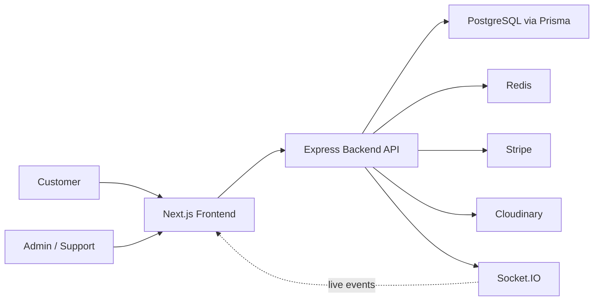
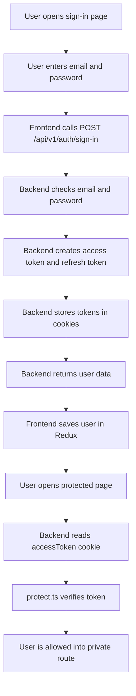
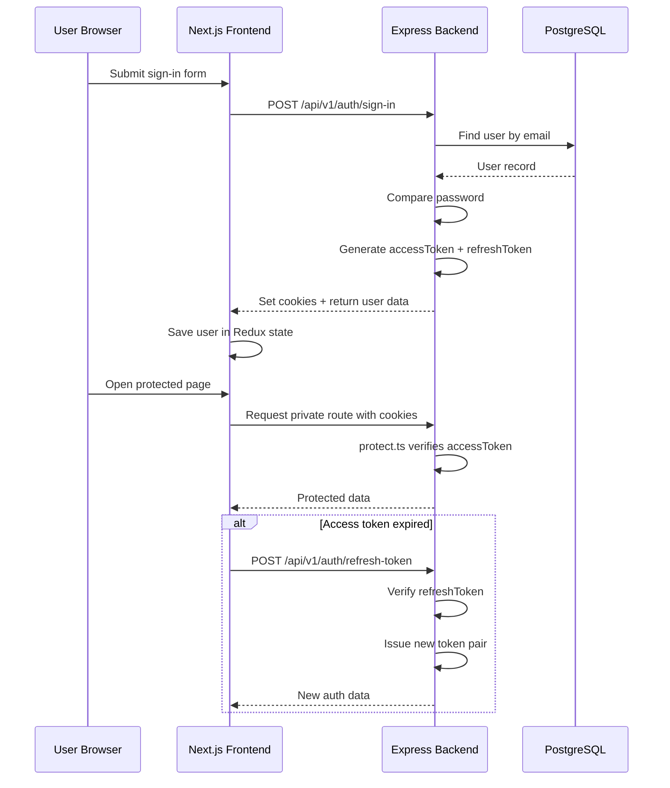

# Project Study Guide

This document explains the project in simple study-friendly language. It covers:

- what the project is
- why it exists
- how it works
- which technologies are used
- why those technologies are used
- what each major feature does
- where the important files are
- what the main folders and file types mean

## 1. What This Project Is

This project is a `full-stack ecommerce application`.

It is not only a normal online store. It also includes:

- a customer storefront
- an admin dashboard
- chat support
- WebRTC support calling
- shared cart collaboration
- goal-based shopping
- checkout recovery
- order tracking
- post-purchase support features

So the project is designed like a `modern commerce platform`, not just a simple shop website.

## 2. Main Purpose of the Project

The project is built to solve more than basic buying and selling.

It helps:

- customers discover products
- customers buy and track orders
- admins manage the store
- support teams chat with customers
- groups shop together through a shared cart
- users shop by `goal` instead of by product only
- the app continue helping users after purchase

## 3. High-Level Architecture

## 4. How the Project Works

### Frontend

The frontend is built in `Next.js`.

It is responsible for:

- showing pages
- collecting user input
- displaying products
- calling APIs
- showing admin dashboard screens
- handling real-time UI updates

Main frontend entry:

- [layout.tsx](C:/Users/nitin200527/Desktop/commrce/ecommerce/src/client/app/layout.tsx)

### Backend

The backend is built in `Express`.

It is responsible for:

- handling routes
- processing business logic
- talking to the database
- managing authentication
- generating orders
- updating shipments
- handling webhooks
- managing live chat and socket events

Main backend entry:

- [server.ts](C:/Users/nitin200527/Desktop/commrce/ecommerce/src/server/src/server.ts)
- [app.ts](C:/Users/nitin200527/Desktop/commrce/ecommerce/src/server/src/app.ts)

### Database

The database is `PostgreSQL`.

The schema is managed through Prisma:

- [schema.prisma](C:/Users/nitin200527/Desktop/commrce/ecommerce/src/server/prisma/schema.prisma)

This file defines models like:

- `User`
- `Product`
- `ProductVariant`
- `Cart`
- `Order`
- `Payment`
- `Shipment`
- `Transaction`
- `Chat`
- `GoalTemplate`
- `SharedCart`

## 5. Why These Technologies Are Used

### `Next.js`

Why used:

- easy routing
- page-based app structure
- good React ecosystem
- strong frontend architecture for public and private pages

Where:

- [src/client/app](C:/Users/nitin200527/Desktop/commrce/ecommerce/src/client/app)

### `React`

Why used:

- reusable UI components
- interactive pages
- hooks for state and logic

Where:

- entire frontend under [src/client/app](C:/Users/nitin200527/Desktop/commrce/ecommerce/src/client/app)

### `TypeScript`

Why used:

- safer code
- better autocomplete
- fewer runtime mistakes

Where:

- frontend and backend both use `.ts` and `.tsx`

### `Express`

Why used:

- simple backend routing
- modular middleware
- good for REST APIs and business logic

Where:

- [src/server/src](C:/Users/nitin200527/Desktop/commrce/ecommerce/src/server/src)

### `Prisma`

Why used:

- type-safe database access
- schema-driven design
- easier relations and migrations

Where:

- [schema.prisma](C:/Users/nitin200527/Desktop/commrce/ecommerce/src/server/prisma/schema.prisma)

### `PostgreSQL`

Why used:

- relational ecommerce data fits well in SQL
- orders, users, carts, and products need strong relations and integrity

### `Redux Toolkit` and `RTK Query`

Why used:

- frontend state management
- API calling and caching
- less boilerplate for server data fetching

Where:

- [store/apis](C:/Users/nitin200527/Desktop/commrce/ecommerce/src/client/app/store/apis)

### `Apollo Client` and `Apollo Server`

Why used:

- flexible query handling for analytics and GraphQL flows

### `Socket.IO`

Why used:

- real-time communication
- chat updates
- shared-cart updates
- live order updates

Where:

- [socket.ts](C:/Users/nitin200527/Desktop/commrce/ecommerce/src/server/src/infra/socket/socket.ts)

### `WebRTC`

Why used:

- browser-to-browser audio/video calling
- used for support call signaling

Where:

- [useWebRTCCall.ts](C:/Users/nitin200527/Desktop/commrce/ecommerce/src/client/app/(private)/(chat)/useWebRTCCall.ts)

### `Stripe`

Why used:

- secure payment processing
- checkout sessions
- payment webhooks

Where:

- [checkout.service.ts](C:/Users/nitin200527/Desktop/commrce/ecommerce/src/server/src/modules/checkout/checkout.service.ts)
- [webhook.service.ts](C:/Users/nitin200527/Desktop/commrce/ecommerce/src/server/src/modules/webhook/webhook.service.ts)

### `Redis`

Why used:

- session store
- runtime infrastructure
- cache-style support

Where:

- configured in [app.ts](C:/Users/nitin200527/Desktop/commrce/ecommerce/src/server/src/app.ts)

### `Cloudinary`

Why used:

- media and image hosting

### `Passport`

Why used:

- social login strategies like Google, Facebook, and Twitter

### `Winston`

Why used:

- structured backend logging

## 6. Folder Structure and Meaning

### Root

- [src](C:/Users/nitin200527/Desktop/commrce/ecommerce/src): main source folder
- [assets](C:/Users/nitin200527/Desktop/commrce/ecommerce/assets): images and project assets
- [collections](C:/Users/nitin200527/Desktop/commrce/ecommerce/collections): API collections
- [README.md](C:/Users/nitin200527/Desktop/commrce/ecommerce/README.md): basic project overview

### `src/client`

Frontend application.

Important folders:

- [app](C:/Users/nitin200527/Desktop/commrce/ecommerce/src/client/app): Next.js routes and UI
- [store](C:/Users/nitin200527/Desktop/commrce/ecommerce/src/client/app/store): Redux store and API slices
- [components](C:/Users/nitin200527/Desktop/commrce/ecommerce/src/client/app/components): reusable UI parts
- [hooks](C:/Users/nitin200527/Desktop/commrce/ecommerce/src/client/app/hooks): reusable frontend logic
- [lib](C:/Users/nitin200527/Desktop/commrce/ecommerce/src/client/app/lib): config and constants
- [utils](C:/Users/nitin200527/Desktop/commrce/ecommerce/src/client/app/utils): helper functions

### `src/server`

Backend application.

Important folders:

- [src](C:/Users/nitin200527/Desktop/commrce/ecommerce/src/server/src): backend source
- [modules](C:/Users/nitin200527/Desktop/commrce/ecommerce/src/server/src/modules): feature-based business modules
- [infra](C:/Users/nitin200527/Desktop/commrce/ecommerce/src/server/src/infra): infrastructure code like DB, cache, socket, logging
- [shared](C:/Users/nitin200527/Desktop/commrce/ecommerce/src/server/src/shared): shared helpers, middleware, constants, errors
- [prisma](C:/Users/nitin200527/Desktop/commrce/ecommerce/src/server/prisma): schema and migrations
- [seeds](C:/Users/nitin200527/Desktop/commrce/ecommerce/src/server/seeds): database seed data

## 7. What the Main File Types Mean

- `.tsx`: React UI file with JSX
- `.ts`: TypeScript logic file
- `page.tsx`: Next.js route page
- `layout.tsx`: common wrapper for pages
- `routes.ts`: backend route definitions
- `controller.ts`: receives request and sends response
- `service.ts`: main business logic
- `repository.ts`: database access layer
- `Api.ts`: frontend RTK Query API client
- `schema.prisma`: database blueprint

## 8. Frontend Route Groups

### Public routes

Where:

- [src/client/app/(public)](C:/Users/nitin200527/Desktop/commrce/ecommerce/src/client/app/(public))

Meaning:

- pages anyone can visit

Examples:

- home
- shop
- cart
- goals
- shipping
- returns
- size guide
- track order

### Private routes

Where:

- [src/client/app/(private)](C:/Users/nitin200527/Desktop/commrce/ecommerce/src/client/app/(private))

Meaning:

- logged-in user pages and dashboard pages

Examples:

- orders
- support
- profile
- chats
- dashboard

## 9. Main Features of the Project

### 9.1 Storefront

What it does:

- shows the shop to customers

How we do it:

- public Next.js pages call backend product/category APIs

Why we do it:

- customers need a clean shopping interface

Main files:

- [shop/page.tsx](C:/Users/nitin200527/Desktop/commrce/ecommerce/src/client/app/(public)/shop/page.tsx)
- [ProductApi.ts](C:/Users/nitin200527/Desktop/commrce/ecommerce/src/client/app/store/apis/ProductApi.ts)

### 9.2 Product Catalog

What it does:

- stores products, variants, categories, attributes, and reviews

How we do it:

- Prisma models plus backend CRUD modules

Why we do it:

- ecommerce needs structured product data

Main files:

- [schema.prisma](C:/Users/nitin200527/Desktop/commrce/ecommerce/src/server/prisma/schema.prisma)
- [src/server/src/modules/product](C:/Users/nitin200527/Desktop/commrce/ecommerce/src/server/src/modules/product)
- [src/server/src/modules/category](C:/Users/nitin200527/Desktop/commrce/ecommerce/src/server/src/modules/category)
- [src/server/src/modules/variant](C:/Users/nitin200527/Desktop/commrce/ecommerce/src/server/src/modules/variant)

### 9.3 Authentication

What it does:

- handles sign up, sign in, refresh, sign out, social login, forgot password, and reset password

How we do it:

- Express auth routes, JWT, cookies, Passport, Redis-backed session support

Why we do it:

- users and admins need secure access

Main files:

- [auth.routes.ts](C:/Users/nitin200527/Desktop/commrce/ecommerce/src/server/src/modules/auth/auth.routes.ts)
- [auth.controller.ts](C:/Users/nitin200527/Desktop/commrce/ecommerce/src/server/src/modules/auth/auth.controller.ts)
- [auth.service.ts](C:/Users/nitin200527/Desktop/commrce/ecommerce/src/server/src/modules/auth/auth.service.ts)
- [AuthApi.ts](C:/Users/nitin200527/Desktop/commrce/ecommerce/src/client/app/store/apis/AuthApi.ts)
- [protect.ts](C:/Users/nitin200527/Desktop/commrce/ecommerce/src/server/src/shared/middlewares/protect.ts)
- [authorizeRole.ts](C:/Users/nitin200527/Desktop/commrce/ecommerce/src/server/src/shared/middlewares/authorizeRole.ts)

Authentication flow in simple words:

1. User signs up or signs in.
2. Backend validates the user.
3. Backend creates `accessToken` and `refreshToken`.
4. Tokens are stored in cookies.
5. Protected backend routes read the cookie and verify the access token.
6. If the user opens a protected admin or user page, the frontend checks whether the user is authenticated.
7. If the access token expires, the app can use the refresh-token flow to issue a new one.

What each important auth file means:

- `auth.routes.ts`: defines auth endpoints like sign-up, sign-in, refresh-token, forgot-password, reset-password, and social callbacks
- `auth.controller.ts`: handles request/response logic, sets cookies, clears cookies, and returns the API response
- `auth.service.ts`: does the real auth work like checking password, generating tokens, hashing reset tokens, and sending reset emails
- `protect.ts`: middleware that blocks private routes unless a valid access token exists
- `authorizeRole.ts`: middleware that checks whether the current user is allowed to access admin-only features
- `AuthApi.ts`: frontend API slice that calls auth routes and stores the logged-in user in Redux state

Why JWT is used:

- to identify the user securely on later requests
- to avoid sending raw password again and again

Why cookies are used:

- to store auth tokens on the browser side
- to let the backend read them automatically on later requests

Why refresh token exists:

- access tokens should be short-lived for security
- refresh tokens help the user stay logged in without typing password again

Why Passport is used:

- it makes social login easier for providers like Google, Facebook, and Twitter

Why role-based auth is used:

- normal users should not access admin pages
- admins and superadmins need different permissions

One important project-specific detail:

- after successful sign-in or social login, the backend also tries to merge the guest/session cart into the user cart
- this is done so users do not lose cart items when they log in

#### Login flow diagram

#### Request-response auth sequence

#### Beginner version in very simple language

Authentication means:

- `who are you?`
- `are you allowed to enter this page?`

Very simple example:

1. You type email and password.
2. The backend checks whether you are a real user.
3. If correct, the backend gives you login proof.
4. That proof is stored in cookies.
5. When you open another private page, the backend checks that proof.
6. If proof is valid, you enter.
7. If proof is missing or expired, you must log in again or refresh the session.

In simple words:

- `access token` means short-term login proof
- `refresh token` means backup login proof for getting a new access token
- `protect.ts` means gatekeeper for private routes
- `authorizeRole.ts` means permission checker for admin-only pages

Why this is good:

- safer than checking password on every request
- keeps the user logged in smoothly
- blocks normal users from admin pages

### 9.4 Cart

What it does:

- stores what the user wants to buy

How we do it:

- cart tables and cart APIs manage cart items and quantity

Why we do it:

- users need to collect products before checkout

Main files:

- [cart/page.tsx](C:/Users/nitin200527/Desktop/commrce/ecommerce/src/client/app/(public)/cart/page.tsx)
- [CartApi.ts](C:/Users/nitin200527/Desktop/commrce/ecommerce/src/client/app/store/apis/CartApi.ts)
- [src/server/src/modules/cart](C:/Users/nitin200527/Desktop/commrce/ecommerce/src/server/src/modules/cart)

### 9.5 Checkout

What it does:

- starts payment and converts cart into order

How we do it:

- checkout module tracks attempts, creates Stripe sessions, records recovery state

Why we do it:

- checkout is the core payment flow

Main files:

- [checkout.service.ts](C:/Users/nitin200527/Desktop/commrce/ecommerce/src/server/src/modules/checkout/checkout.service.ts)
- [CheckoutApi.ts](C:/Users/nitin200527/Desktop/commrce/ecommerce/src/client/app/store/apis/CheckoutApi.ts)

### 9.6 Orders, Payments, Shipments, Transactions

What it does:

- stores the final purchase and its status

How we do it:

- separate but related database models and backend modules

Why we do it:

- real ecommerce needs order lifecycle management

Main files:

- [order.service.ts](C:/Users/nitin200527/Desktop/commrce/ecommerce/src/server/src/modules/order/order.service.ts)
- [src/server/src/modules/payment](C:/Users/nitin200527/Desktop/commrce/ecommerce/src/server/src/modules/payment)
- [src/server/src/modules/shipment](C:/Users/nitin200527/Desktop/commrce/ecommerce/src/server/src/modules/shipment)
- [src/server/src/modules/transaction](C:/Users/nitin200527/Desktop/commrce/ecommerce/src/server/src/modules/transaction)

### 9.7 Public Order Tracking

What it does:

- lets customers check order progress using order ID and email

How we do it:

- a public lookup route returns shipment, address, timeline, and item summary

Why we do it:

- customers want visibility after ordering

Main files:

- [track-order/page.tsx](C:/Users/nitin200527/Desktop/commrce/ecommerce/src/client/app/(public)/track-order/page.tsx)
- [OrderApi.ts](C:/Users/nitin200527/Desktop/commrce/ecommerce/src/client/app/store/apis/OrderApi.ts)
- [order.service.ts](C:/Users/nitin200527/Desktop/commrce/ecommerce/src/server/src/modules/order/order.service.ts)

### 9.8 Real-Time Chat Support

What it does:

- lets users and admins send live messages

How we do it:

- Socket.IO rooms plus chat APIs and persisted chat messages

Why we do it:

- support is faster and easier in real time

Main files:

- [support/page.tsx](C:/Users/nitin200527/Desktop/commrce/ecommerce/src/client/app/(private)/support/page.tsx)
- [ChatApi.ts](C:/Users/nitin200527/Desktop/commrce/ecommerce/src/client/app/store/apis/ChatApi.ts)
- [src/server/src/modules/chat](C:/Users/nitin200527/Desktop/commrce/ecommerce/src/server/src/modules/chat)
- [socket.ts](C:/Users/nitin200527/Desktop/commrce/ecommerce/src/server/src/infra/socket/socket.ts)

### 9.9 WebRTC Support Calls

What it does:

- allows call signaling for audio/video support calls

How we do it:

- WebRTC handles media, Socket.IO handles offer/answer/ICE signaling

Why we do it:

- some issues are easier to solve on a live call

Main files:

- [useWebRTCCall.ts](C:/Users/nitin200527/Desktop/commrce/ecommerce/src/client/app/(private)/(chat)/useWebRTCCall.ts)
- [socket.ts](C:/Users/nitin200527/Desktop/commrce/ecommerce/src/server/src/infra/socket/socket.ts)

### 9.10 Shared Cart

What it does:

- allows multiple people to collaborate on one cart

How we do it:

- shared cart code, shared members, notes, votes, and socket events

Why we do it:

- group shopping is a unique commerce feature

Main files:

- [share/[code]/page.tsx](C:/Users/nitin200527/Desktop/commrce/ecommerce/src/client/app/(public)/cart/share/[code]/page.tsx)
- [SharedCartApi.ts](C:/Users/nitin200527/Desktop/commrce/ecommerce/src/client/app/store/apis/SharedCartApi.ts)
- [shared-cart.service.ts](C:/Users/nitin200527/Desktop/commrce/ecommerce/src/server/src/modules/shared-cart/shared-cart.service.ts)

### 9.11 Goal-Based Shopping

What it does:

- helps users shop by outcome like `WFH setup` or `gaming starter pack`

How we do it:

- goal templates and goal steps are stored in DB, and bundles are generated at runtime based on stock, category, keywords, and budget

Why we do it:

- outcome-based shopping is easier than product-by-product shopping

Main files:

- [goals/page.tsx](C:/Users/nitin200527/Desktop/commrce/ecommerce/src/client/app/(public)/goals/page.tsx)
- [goals/[slug]/page.tsx](C:/Users/nitin200527/Desktop/commrce/ecommerce/src/client/app/(public)/goals/[slug]/page.tsx)
- [goal.service.ts](C:/Users/nitin200527/Desktop/commrce/ecommerce/src/server/src/modules/goal/goal.service.ts)

### 9.12 Goal Success Tracking

What it does:

- asks whether an order actually solved the user’s original goal

How we do it:

- the order page loads a goal-success card, the user saves a check-in, and the backend stores interventions for recovery or follow-up

Why we do it:

- success should be measured by outcome, not only by delivery

Main files:

- [GoalSuccessTrackerCard.tsx](C:/Users/nitin200527/Desktop/commrce/ecommerce/src/client/app/(private)/(user)/orders/GoalSuccessTrackerCard.tsx)
- [order.service.ts](C:/Users/nitin200527/Desktop/commrce/ecommerce/src/server/src/modules/order/order.service.ts)

### 9.13 Order Companion

What it does:

- gives setup, care, warranty, reorder, and support guidance after purchase

How we do it:

- the order module creates companion tasks and product-support content

Why we do it:

- support after purchase improves retention

Main files:

- [order.service.ts](C:/Users/nitin200527/Desktop/commrce/ecommerce/src/server/src/modules/order/order.service.ts)

### 9.14 Admin Dashboard

What it does:

- gives admins control over store operations

How we do it:

- private dashboard pages call backend CRUD and analytics routes

Why we do it:

- admins need to manage products, users, chats, transactions, logs, and analytics

Main files:

- [dashboard/page.tsx](C:/Users/nitin200527/Desktop/commrce/ecommerce/src/client/app/(private)/dashboard/page.tsx)
- [dashboard/analytics/page.tsx](C:/Users/nitin200527/Desktop/commrce/ecommerce/src/client/app/(private)/dashboard/analytics/page.tsx)
- [dashboard/chats/page.tsx](C:/Users/nitin200527/Desktop/commrce/ecommerce/src/client/app/(private)/dashboard/chats/page.tsx)

### 9.15 Analytics

What it does:

- shows store performance and business metrics

How we do it:

- analytics routes return summarized data to dashboard pages

Why we do it:

- businesses need insight into revenue, users, and product performance

Main files:

- [analytics.routes.ts](C:/Users/nitin200527/Desktop/commrce/ecommerce/src/server/src/modules/analytics/analytics.routes.ts)
- [AnalyticsApi.ts](C:/Users/nitin200527/Desktop/commrce/ecommerce/src/client/app/store/apis/AnalyticsApi.ts)

### 9.16 Reports

What it does:

- generates export-style report data

How we do it:

- reports module stores metadata and serves generated report flows

Why we do it:

- admin teams need downloadable business reports

Main files:

- [reports.routes.ts](C:/Users/nitin200527/Desktop/commrce/ecommerce/src/server/src/modules/reports/reports.routes.ts)
- [ReportsApi.ts](C:/Users/nitin200527/Desktop/commrce/ecommerce/src/client/app/store/apis/ReportsApi.ts)

### 9.17 Logs

What it does:

- stores and exposes operational logs

How we do it:

- logs module plus Winston logger

Why we do it:

- useful for debugging and administration

Main files:

- [logs.routes.ts](C:/Users/nitin200527/Desktop/commrce/ecommerce/src/server/src/modules/logs/logs.routes.ts)

### 9.18 Webhooks

What it does:

- receives third-party event callbacks, mainly payment events

How we do it:

- raw-body webhook route processes external notifications

Why we do it:

- Stripe needs webhooks to confirm events safely

Main files:

- [webhook.service.ts](C:/Users/nitin200527/Desktop/commrce/ecommerce/src/server/src/modules/webhook/webhook.service.ts)

## 10. API Structure

The backend mounts versioned routes here:

- [routes/v1/index.ts](C:/Users/nitin200527/Desktop/commrce/ecommerce/src/server/src/routes/v1/index.ts)

This means the API is organized like:

- `/api/v1/auth`
- `/api/v1/products`
- `/api/v1/cart`
- `/api/v1/orders`
- `/api/v1/chat`
- `/api/v1/goals`
- `/api/v1/shared-carts`

Why:

- versioned APIs are easier to maintain and extend

## 11. Why the Project Structure Is Good

This project uses `feature-based modular structure`.

That means each business area has its own folder:

- auth
- cart
- chat
- goal
- order
- product

Why that is useful:

- easier to maintain
- easier to debug
- easier to scale
- easier to add future features

## 12. Best Way to Study This Project

Study it in this order:

1. Read [README.md](C:/Users/nitin200527/Desktop/commrce/ecommerce/README.md)
2. Read [APPLICATION_DOCUMENTATION.md](C:/Users/nitin200527/Desktop/commrce/ecommerce/APPLICATION_DOCUMENTATION.md)
3. Read [schema.prisma](C:/Users/nitin200527/Desktop/commrce/ecommerce/src/server/prisma/schema.prisma)
4. Read [app.ts](C:/Users/nitin200527/Desktop/commrce/ecommerce/src/server/src/app.ts)
5. Read [routes/v1/index.ts](C:/Users/nitin200527/Desktop/commrce/ecommerce/src/server/src/routes/v1/index.ts)
6. Read one full module end to end:
   - route
   - controller
   - service
   - repository
7. Study these best modules first:
   - `auth`
   - `product`
   - `cart`
   - `checkout`
   - `order`
   - `chat`
   - `goal`
   - `shared-cart`

## 13. Best Short Summary

This project is a full-stack ecommerce platform built with Next.js on the frontend and Express/Prisma on the backend. It supports shopping, authentication, cart, checkout, orders, tracking, admin operations, analytics, real-time chat, support calls, shared carts, goal-based shopping, and post-purchase support features. The architecture is modular, feature-based, and designed to behave more like a real commerce platform than a basic store demo.

## 14. Next.js Structure and Routing

### Why Next.js is a good fit for this project

This project has:

- many pages
- public and private screens
- admin dashboard pages
- dynamic product and order pages
- route-based organization needs

Next.js is a good fit because it gives:

- file-based routing
- dynamic routes
- layouts
- route groups
- strong structure for large React apps

Main frontend root:

- [src/client/app](C:/Users/nitin200527/Desktop/commrce/ecommerce/src/client/app)

### What file-based routing means

File-based routing means:

- routes come from folders and files
- you do not manually write a separate routing config for every page

Examples:

- [shop/page.tsx](C:/Users/nitin200527/Desktop/commrce/ecommerce/src/client/app/(public)/shop/page.tsx) -> `/shop`
- [sign-in/page.tsx](C:/Users/nitin200527/Desktop/commrce/ecommerce/src/client/app/(auth)/sign-in/page.tsx) -> `/sign-in`
- [dashboard/page.tsx](C:/Users/nitin200527/Desktop/commrce/ecommerce/src/client/app/(private)/dashboard/page.tsx) -> `/dashboard`

Why it is helpful:

- easier to understand routes
- easier to find the page file
- less routing boilerplate

### What dynamic routes mean

Dynamic routes are variable route parts written with square brackets.

Examples:

- [product/[slug]/page.tsx](C:/Users/nitin200527/Desktop/commrce/ecommerce/src/client/app/(public)/product/[slug]/page.tsx) -> `/product/:slug`
- [orders/[orderId]/page.tsx](C:/Users/nitin200527/Desktop/commrce/ecommerce/src/client/app/(private)/(user)/orders/[orderId]/page.tsx) -> `/orders/:orderId`
- [cart/share/[code]/page.tsx](C:/Users/nitin200527/Desktop/commrce/ecommerce/src/client/app/(public)/cart/share/[code]/page.tsx) -> `/cart/share/:code`

Why dynamic routes are helpful:

- one page can handle many products or orders
- no need to create one file per product

### What route groups like `(auth)` and `(private)` mean

Folders in parentheses are route groups.

Examples:

- [src/client/app/(auth)](C:/Users/nitin200527/Desktop/commrce/ecommerce/src/client/app/(auth))
- [src/client/app/(public)](C:/Users/nitin200527/Desktop/commrce/ecommerce/src/client/app/(public))
- [src/client/app/(private)](C:/Users/nitin200527/Desktop/commrce/ecommerce/src/client/app/(private))
- [src/client/app/(private)/(chat)](C:/Users/nitin200527/Desktop/commrce/ecommerce/src/client/app/(private)/(chat))

Meaning:

- they group files for developers
- they do not appear in the browser URL

Example:

- [src/client/app/(auth)/sign-in/page.tsx](C:/Users/nitin200527/Desktop/commrce/ecommerce/src/client/app/(auth)/sign-in/page.tsx) -> `/sign-in`
- not `/(auth)/sign-in`

Why this is useful:

- keeps auth, private, public, and chat code organized
- keeps URLs clean

### What `page.tsx`, `layout.tsx`, and `[slug]` do together

- `page.tsx` = the actual route screen
- `layout.tsx` = wrapper around child pages
- `[slug]` = dynamic URL value

Example:

- [layout.tsx](C:/Users/nitin200527/Desktop/commrce/ecommerce/src/client/app/layout.tsx) wraps the whole app
- [dashboard/layout.tsx](C:/Users/nitin200527/Desktop/commrce/ecommerce/src/client/app/(private)/dashboard/layout.tsx) wraps dashboard pages
- [product/[slug]/page.tsx](C:/Users/nitin200527/Desktop/commrce/ecommerce/src/client/app/(public)/product/[slug]/page.tsx) renders one dynamic product page

Flow:

1. user opens a URL like `/product/gaming-chair-pro`
2. root layout loads
3. Next.js reads `product`
4. Next.js fills `[slug]` with `gaming-chair-pro`
5. the `page.tsx` file renders the screen

### Common route mapping

- [app/page.tsx](C:/Users/nitin200527/Desktop/commrce/ecommerce/src/client/app/page.tsx) -> `/`
- [shop/page.tsx](C:/Users/nitin200527/Desktop/commrce/ecommerce/src/client/app/(public)/shop/page.tsx) -> `/shop`
- [cart/page.tsx](C:/Users/nitin200527/Desktop/commrce/ecommerce/src/client/app/(public)/cart/page.tsx) -> `/cart`
- [cart/share/[code]/page.tsx](C:/Users/nitin200527/Desktop/commrce/ecommerce/src/client/app/(public)/cart/share/[code]/page.tsx) -> `/cart/share/:code`
- [goals/page.tsx](C:/Users/nitin200527/Desktop/commrce/ecommerce/src/client/app/(public)/goals/page.tsx) -> `/goals`
- [goals/[slug]/page.tsx](C:/Users/nitin200527/Desktop/commrce/ecommerce/src/client/app/(public)/goals/[slug]/page.tsx) -> `/goals/:slug`
- [product/[slug]/page.tsx](C:/Users/nitin200527/Desktop/commrce/ecommerce/src/client/app/(public)/product/[slug]/page.tsx) -> `/product/:slug`
- [sign-in/page.tsx](C:/Users/nitin200527/Desktop/commrce/ecommerce/src/client/app/(auth)/sign-in/page.tsx) -> `/sign-in`
- [sign-up/page.tsx](C:/Users/nitin200527/Desktop/commrce/ecommerce/src/client/app/(auth)/sign-up/page.tsx) -> `/sign-up`
- [password-reset/[token]/page.tsx](C:/Users/nitin200527/Desktop/commrce/ecommerce/src/client/app/(auth)/password-reset/[token]/page.tsx) -> `/password-reset/:token`
- [orders/page.tsx](C:/Users/nitin200527/Desktop/commrce/ecommerce/src/client/app/(private)/(user)/orders/page.tsx) -> `/orders`
- [orders/[orderId]/page.tsx](C:/Users/nitin200527/Desktop/commrce/ecommerce/src/client/app/(private)/(user)/orders/[orderId]/page.tsx) -> `/orders/:orderId`
- [profile/page.tsx](C:/Users/nitin200527/Desktop/commrce/ecommerce/src/client/app/(private)/(user)/profile/page.tsx) -> `/profile`
- [support/page.tsx](C:/Users/nitin200527/Desktop/commrce/ecommerce/src/client/app/(private)/support/page.tsx) -> `/support`
- [dashboard/analytics/page.tsx](C:/Users/nitin200527/Desktop/commrce/ecommerce/src/client/app/(private)/dashboard/analytics/page.tsx) -> `/dashboard/analytics`

## 15. React Structure and Component Design

### React-related technologies used

- `React 19`: component-based UI
- `Next.js 15`: React framework and routing
- `TypeScript`: typed components and safer props
- `Redux Toolkit`: shared frontend state
- `RTK Query`: REST API data layer
- `Apollo Client`: GraphQL data layer
- `React Hook Form`: form handling
- `Framer Motion`: animation
- `Socket.IO Client`: live communication

### Main frontend structure

- [components](C:/Users/nitin200527/Desktop/commrce/ecommerce/src/client/app/components): reusable UI
- [hooks](C:/Users/nitin200527/Desktop/commrce/ecommerce/src/client/app/hooks): reusable frontend logic
- [store](C:/Users/nitin200527/Desktop/commrce/ecommerce/src/client/app/store): Redux and API state
- [gql](C:/Users/nitin200527/Desktop/commrce/ecommerce/src/client/app/gql): GraphQL queries
- [lib](C:/Users/nitin200527/Desktop/commrce/ecommerce/src/client/app/lib): config/constants

### Atomic design naming used in this project

This project uses names like:

- `atoms`
- `molecules`
- `templates`

These are UI organization names, not Redux terms.

#### Atoms

Atoms are the smallest UI building blocks.

Examples:

- [Button.tsx](C:/Users/nitin200527/Desktop/commrce/ecommerce/src/client/app/components/atoms/Button.tsx)
- [Input.tsx](C:/Users/nitin200527/Desktop/commrce/ecommerce/src/client/app/components/atoms/Input.tsx)
- [TextArea.tsx](C:/Users/nitin200527/Desktop/commrce/ecommerce/src/client/app/components/atoms/TextArea.tsx)

Meaning:

- small reusable UI parts

#### Molecules

Molecules combine a few atoms into one useful UI piece.

Examples:

- [QuantitySelector.tsx](C:/Users/nitin200527/Desktop/commrce/ecommerce/src/client/app/components/molecules/QuantitySelector.tsx)
- [SearchBar.tsx](C:/Users/nitin200527/Desktop/commrce/ecommerce/src/client/app/components/molecules/SearchBar.tsx)
- [UserMenu.tsx](C:/Users/nitin200527/Desktop/commrce/ecommerce/src/client/app/components/molecules/UserMenu.tsx)

Meaning:

- small functional component groups

#### Templates

Templates give page-level structure.

Examples:

- [MainLayout.tsx](C:/Users/nitin200527/Desktop/commrce/ecommerce/src/client/app/components/templates/MainLayout.tsx)
- [AuthLayout.tsx](C:/Users/nitin200527/Desktop/commrce/ecommerce/src/client/app/components/templates/AuthLayout.tsx)

Meaning:

- shared layout structure like navbar, footer, main content shell

## 16. Styling and CSS

This project mainly uses `Tailwind CSS 4`.

Where:

- [src/client/package.json](C:/Users/nitin200527/Desktop/commrce/ecommerce/src/client/package.json)
- [globals.css](C:/Users/nitin200527/Desktop/commrce/ecommerce/src/client/app/globals.css)

How it is used:

- most styling is written directly in `className`
- global theme styles and utility classes are in `globals.css`

Example meaning of common Tailwind classes:

- `flex` = use flexbox
- `items-center` = center children vertically
- `justify-center` = center children horizontally
- `rounded-lg` = rounded corners
- `shadow-lg` = large shadow
- `p-4` = padding
- `text-sm` = small text

Why Tailwind is used:

- faster UI styling
- consistent spacing and colors
- less custom CSS repetition

## 17. Redux Toolkit and RTK Query

### Why Redux Toolkit is used

Redux Toolkit is used for:

- shared frontend state
- standardized API state
- less Redux boilerplate

Main files:

- [store.ts](C:/Users/nitin200527/Desktop/commrce/ecommerce/src/client/app/store/store.ts)
- [hooks.ts](C:/Users/nitin200527/Desktop/commrce/ecommerce/src/client/app/store/hooks.ts)
- [ApiSlice.ts](C:/Users/nitin200527/Desktop/commrce/ecommerce/src/client/app/store/slices/ApiSlice.ts)
- [AuthSlice.ts](C:/Users/nitin200527/Desktop/commrce/ecommerce/src/client/app/store/slices/AuthSlice.ts)
- [ToastSlice.ts](C:/Users/nitin200527/Desktop/commrce/ecommerce/src/client/app/store/slices/ToastSlice.ts)
- [ClientProviders.tsx](C:/Users/nitin200527/Desktop/commrce/ecommerce/src/client/app/ClientProviders.tsx)

### What reducers and actions mean

- `action` = a message saying something happened
- `reducer` = the function that updates state based on that action

Real project actions:

- `setUser`
- `logout`
- `addToast`
- `removeToast`

Real project reducers:

- reducers inside [AuthSlice.ts](C:/Users/nitin200527/Desktop/commrce/ecommerce/src/client/app/store/slices/AuthSlice.ts)
- reducers inside [ToastSlice.ts](C:/Users/nitin200527/Desktop/commrce/ecommerce/src/client/app/store/slices/ToastSlice.ts)

### Main Redux functions used

- `configureStore()` = creates the store
- `createSlice()` = creates slice state + reducers + actions
- `dispatch()` = sends an action
- `useAppSelector()` = reads state
- `useAppDispatch()` = dispatches actions

### How store state looks here

In [store.ts](C:/Users/nitin200527/Desktop/commrce/ecommerce/src/client/app/store/store.ts), the store registers:

- `auth`
- `toasts`
- `api`

So the main state is roughly:

- `state.auth`
- `state.toasts`
- `state.api`

### Why RTK Query is used

RTK Query is used to handle REST API communication with:

- automatic hooks
- loading state
- error state
- caching
- refetching
- refresh-token retry support

### What `createApi()`, `fetchBaseQuery()`, and `injectEndpoints()` mean

#### `createApi()`

Used in [ApiSlice.ts](C:/Users/nitin200527/Desktop/commrce/ecommerce/src/client/app/store/slices/ApiSlice.ts)

Meaning:

- creates the shared RTK Query API base for the whole app

#### `fetchBaseQuery()`

Also used in [ApiSlice.ts](C:/Users/nitin200527/Desktop/commrce/ecommerce/src/client/app/store/slices/ApiSlice.ts)

Meaning:

- built-in RTK Query request function
- handles shared HTTP behavior like backend base URL and cookies

In this project it is wrapped with refresh-token retry logic.

#### `injectEndpoints()`

Used in files like:

- [AuthApi.ts](C:/Users/nitin200527/Desktop/commrce/ecommerce/src/client/app/store/apis/AuthApi.ts)
- [CartApi.ts](C:/Users/nitin200527/Desktop/commrce/ecommerce/src/client/app/store/apis/CartApi.ts)

Meaning:

- adds feature-specific endpoints into the shared API base

### Query vs mutation

- `query` = read/fetch data
- `mutation` = create/update/delete/change data

Examples:

- `getCart` is a query in [CartApi.ts](C:/Users/nitin200527/Desktop/commrce/ecommerce/src/client/app/store/apis/CartApi.ts)
- `removeFromCart` is a mutation in [CartApi.ts](C:/Users/nitin200527/Desktop/commrce/ecommerce/src/client/app/store/apis/CartApi.ts)
- `signIn` is a mutation in [AuthApi.ts](C:/Users/nitin200527/Desktop/commrce/ecommerce/src/client/app/store/apis/AuthApi.ts)

### `providesTags` vs `invalidatesTags`

- `providesTags` = marks cached query data
- `invalidatesTags` = tells RTK Query that cached data is stale and should refetch

Cart example:

- `getCart` provides tag `Cart`
- `addToCart`, `updateCartItem`, and `removeFromCart` invalidate tag `Cart`

That is why cart data refreshes automatically after cart changes.

### One full RTK Query example from cart

1. [CartApi.ts](C:/Users/nitin200527/Desktop/commrce/ecommerce/src/client/app/store/apis/CartApi.ts) defines `getCart` and `removeFromCart`
2. RTK Query generates `useGetCartQuery()` and `useRemoveFromCartMutation()`
3. [cart/page.tsx](C:/Users/nitin200527/Desktop/commrce/ecommerce/src/client/app/(public)/cart/page.tsx) uses those hooks
4. `useGetCartQuery()` loads cart data
5. `removeFromCart()` deletes one item
6. `invalidatesTags: ["Cart"]` causes cart data to refetch
7. the cart page re-renders with fresh data

## 18. REST, GraphQL, WebSocket, and WebRTC

### What REST is

REST is a way of building APIs using endpoints and HTTP methods.

Examples in this project:

- `/api/v1/auth/sign-in`
- `/api/v1/cart`
- `/api/v1/orders`

Where routes are mounted:

- [routes/v1/index.ts](C:/Users/nitin200527/Desktop/commrce/ecommerce/src/server/src/routes/v1/index.ts)

Why used:

- simple and good for standard ecommerce CRUD flows

### What GraphQL is

GraphQL lets the frontend ask for exactly the fields it needs.

Simple meaning:

- REST = many fixed endpoints
- GraphQL = usually one endpoint with flexible query shape

Where used:

- backend GraphQL setup: [src/server/src/graphql/index.ts](C:/Users/nitin200527/Desktop/commrce/ecommerce/src/server/src/graphql/index.ts)
- frontend query files: [src/client/app/gql](C:/Users/nitin200527/Desktop/commrce/ecommerce/src/client/app/gql)

Important meanings:

- `one endpoint` means many GraphQL queries go to one URL like `/api/v1/graphql`
- request body contains `query`, `variables`, and sometimes `operationName`
- resolver is the backend function that fetches the requested field data

Product GraphQL example files:

- [schema.ts](C:/Users/nitin200527/Desktop/commrce/ecommerce/src/server/src/modules/product/graphql/schema.ts)
- [resolver.ts](C:/Users/nitin200527/Desktop/commrce/ecommerce/src/server/src/modules/product/graphql/resolver.ts)
- [Product.ts](C:/Users/nitin200527/Desktop/commrce/ecommerce/src/client/app/gql/Product.ts)

### What WebSocket means here

This project uses `Socket.IO` for real-time communication.

Used for:

- chat updates
- typing indicators
- shared cart updates
- live order updates
- WebRTC signaling

Main file:

- [socket.ts](C:/Users/nitin200527/Desktop/commrce/ecommerce/src/server/src/infra/socket/socket.ts)

### What WebRTC means here

WebRTC is used for audio/video calling.

In this project:

- Socket.IO is used for signaling
- WebRTC handles the actual peer-to-peer media connection

Main frontend call logic:

- [useWebRTCCall.ts](C:/Users/nitin200527/Desktop/commrce/ecommerce/src/client/app/(private)/(chat)/useWebRTCCall.ts)

## 19. Prisma and Database Design

### What Prisma is

Prisma is the ORM used by the backend.

ORM means:

- `Object Relational Mapper`

Simple meaning:

- it helps backend TypeScript code talk to PostgreSQL in a structured way

Main file:

- [schema.prisma](C:/Users/nitin200527/Desktop/commrce/ecommerce/src/server/prisma/schema.prisma)

### Why Prisma is important here

This project has many related ecommerce models:

- users
- products
- variants
- carts
- orders
- payments
- shipments
- transactions
- chats
- goal templates
- shared carts

Prisma is important because it helps with:

- type-safe queries
- model relations
- constraints and unique fields
- migrations
- transactions

### What a slug means

A `slug` is a URL-friendly identifier.

Example:

- product name: `Gaming Chair Pro`
- slug: `gaming-chair-pro`

That is why this route works:

- [product/[slug]/page.tsx](C:/Users/nitin200527/Desktop/commrce/ecommerce/src/client/app/(public)/product/[slug]/page.tsx)

### How Prisma relations work here

Relations connect models together.

Examples:

- one `User` has many `Order`
- one `Product` has many `ProductVariant`
- one `Order` has many `OrderItem`
- one `Cart` has many `CartItem`
- one `Chat` has many `ChatMessage`

Those relations are defined in [schema.prisma](C:/Users/nitin200527/Desktop/commrce/ecommerce/src/server/prisma/schema.prisma).

### How Prisma helps normalization

Normalization means:

- store one fact in one place
- avoid unnecessary duplication
- split different concepts into different tables

Examples in this project:

- `Product` is separate from `ProductVariant`
- `Order` is separate from `OrderItem`
- `Cart` is separate from `CartItem`
- `Chat` is separate from `ChatMessage`
- `SharedCart` is separate from members, notes, and votes

Why this is good:

- cleaner data
- fewer duplicates
- easier maintenance

### How Prisma helps transactions

A transaction means:

- all related DB changes succeed together
- or all fail together

This is very important in ecommerce.

Examples:

- checkout creates order, payment, shipment, transaction, stock updates, and cart changes together
- transaction status update changes order, shipment, and tracking event together

Why transactions are important:

- avoids half-completed orders
- keeps stock and order data consistent

## 20. Feature Usage Notes for Studying

### How goal-based shopping is used

User flow:

1. open [goals/page.tsx](C:/Users/nitin200527/Desktop/commrce/ecommerce/src/client/app/(public)/goals/page.tsx)
2. choose a goal
3. open [goals/[slug]/page.tsx](C:/Users/nitin200527/Desktop/commrce/ecommerce/src/client/app/(public)/goals/[slug]/page.tsx)
4. enter budget if needed
5. backend builds a runtime bundle using goal templates and product matching

Important meaning:

- goal templates are stored beforehand
- final goal bundles are usually generated at runtime

### How goal success check-in is used

User flow:

1. user opens order details page
2. [GoalSuccessTrackerCard.tsx](C:/Users/nitin200527/Desktop/commrce/ecommerce/src/client/app/(private)/(user)/orders/GoalSuccessTrackerCard.tsx) loads
3. user selects `SUCCESS`, `PARTIAL`, `FAILED`, or `SKIPPED`
4. user saves a check-in
5. backend stores follow-up interventions

After save:

- the check-in is stored
- the order page shows outcome state
- support/review/recovery actions can appear

## 21. Quick Glossary

- `route group` = folder in parentheses used only for organization
- `dynamic route` = variable route part written as `[name]`
- `slug` = URL-friendly identifier
- `slice` = small Redux state module
- `action` = message sent to Redux
- `reducer` = function that changes Redux state
- `query` = RTK Query read operation
- `mutation` = RTK Query write/change operation
- `resolver` = GraphQL backend function for a field
- `relation` = connection between database models
- `transaction` = all-or-nothing database operation
