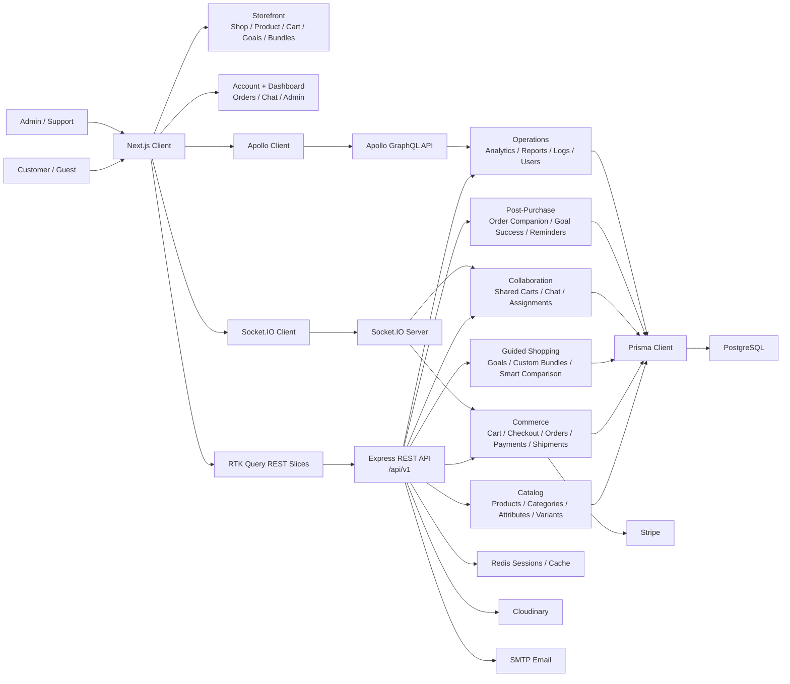

# Architecture

Last updated: April 27, 2026

## System Overview

The application is split into a Next.js frontend and an Express backend.

## Current Feature Architecture

The app is organized around product surfaces rather than one generic catalog page.

| Surface | Frontend paths | Backend modules | Data areas |
| --- | --- | --- | --- |
| Storefront | `app/(public)/shop`, `app/(public)/product`, `app/(public)/cart` | `product`, `category`, `variant`, `cart`, `review` | products, variants, categories, reviews, carts |
| Guided shopping | `app/(public)/goals`, `app/(public)/bundles` | `goal`, `cart`, `shared-cart` | goal templates, goal bundles, bundle items |
| Smart comparison | `app/utils/smartBundleComparison.ts`, goal/custom bundle pages | client-side utility using bundle API data | totals, budget left, locked picks, confidence, coverage |
| Collaboration | `app/(public)/cart/share/[code]`, chat UI | `shared-cart`, `chat` | shared carts, members, votes, notes, assignments, messages |
| Checkout and orders | cart, payment pages, order pages | `checkout`, `order`, `payment`, `shipment`, `transaction`, `webhook` | checkout attempts, recovery, orders, payments, shipments |
| Post-purchase success | `orders/[orderId]`, `OrderCompanionCard`, `GoalSuccessTrackerCard` | `order` | companions, tasks, reminders, goal success check-ins |
| Admin operations | `app/(private)/dashboard` | `analytics`, `reports`, `logs`, `user`, catalog modules | dashboards, reports, logs, users |

## Frontend

Path: `src/client`

Main technologies:

- Next.js 15 App Router
- React 19
- TypeScript
- Tailwind CSS
- Redux Toolkit and RTK Query
- Apollo Client for GraphQL dashboard/catalog data
- Socket.IO client for chat and real-time updates
- Stripe JS for checkout redirection

Key frontend concepts:

- Route groups separate public, private, and auth pages.
- RTK Query API slices in `app/store/apis` centralize REST calls.
- Shared UI components live in `app/components`.
- Feature pages keep feature-specific components near their route.
- Auth and role guards are under `app/components/auth` and `app/components/HOC`.

## Backend

Path: `src/server`

Main technologies:

- Express
- TypeScript
- Prisma ORM
- PostgreSQL
- Apollo Server for GraphQL
- Socket.IO
- Redis-backed sessions
- Passport social auth support
- Stripe
- Cloudinary
- Winston and Morgan logging
- Swagger docs setup

Key backend concepts:

- `src/server/src/app.ts` creates the Express app, middleware stack, Socket.IO server, Swagger, REST routes, GraphQL, and error handling.
- `src/server/src/server.ts` starts the HTTP server.
- `src/server/src/routes/v1/index.ts` mounts versioned REST modules.
- `src/server/src/modules` contains one module per domain.
- Each module generally follows controller, service, repository, routes, dto, factory, and types files.
- `src/server/prisma/schema.prisma` is the source of truth for database models.

## Request Flow

Typical REST flow:

1. A React component calls an RTK Query hook.
2. The hook calls an endpoint from `src/client/app/store/apis`.
3. The API request reaches `/api/v1/...` on the Express backend.
4. A route file maps the HTTP request to a controller.
5. The controller validates/normalizes input and calls a service.
6. The service runs business logic and calls a repository or Prisma directly.
7. The server returns JSON through shared response/error helpers.

Typical GraphQL flow:

1. A dashboard or product query uses Apollo Client.
2. Request goes to the configured GraphQL endpoint.
3. Apollo Server resolves fields using module resolvers.
4. Resolvers read from services/repositories/Prisma.

Typical real-time flow:

1. Frontend connects through Socket.IO.
2. Chat/order/transaction modules emit or listen to events.
3. Socket manager coordinates active server-side IO.

## Smart Bundle Comparison Flow

Smart bundle comparison is currently client-side logic layered over saved/current bundle data.

1. A user builds or loads a current bundle from `/goals/[slug]` or `/bundles`.
2. The page fetches saved bundles through `GoalApi.ts`.
3. The user chooses `Compare` on a saved bundle.
4. The page calls `buildSmartBundleComparison` from `app/utils/smartBundleComparison.ts`.
5. The helper compares total price, budget left, item count, locked picks, confidence, and brief coverage.
6. The UI renders metric winners, current/saved win counts, ties, verdict, and standout notes.

This feature does not require a dedicated backend route because it compares bundle data the goal APIs already return.

## Goal Success And Order Companion Flow

Post-purchase features live on the order detail page.

1. User opens `/orders/[orderId]`.
2. The client calls order APIs for detail, companion data, and goal success state.
3. `OrderCompanionCard` shows setup, care, warranty, reorder, support, and reminder tasks.
4. `GoalSuccessTrackerCard` lets the user record delivery/setup/follow-up outcome.
5. Server order services validate ownership, update goal success records, and create interventions where needed.

## Middleware Stack

The backend configures:

- raw body parsing for Stripe webhook route before JSON middleware
- JSON and URL-encoded body parsing
- signed cookies
- Redis-backed session storage
- Passport initialization
- CORS with credentials
- Helmet security headers
- frameguard
- mongo sanitize protection
- HTTP parameter pollution protection
- Morgan request logging into Winston
- compression
- versioned API routes
- GraphQL
- global error handling

Important file:

- `src/server/src/app.ts`

## API Layers

Frontend API layers:

- REST through RTK Query slices in `src/client/app/store/apis`
- direct Axios instance in `src/client/app/utils/axiosInstance.ts`
- GraphQL operations in `src/client/app/gql`
- Socket hooks in `src/client/app/hooks/network` and chat hooks

Backend API layers:

- REST routes under `/api/v1`
- Stripe webhook under `/api/v1/webhook`
- GraphQL configured by `src/server/src/graphql`
- Socket.IO configured by `src/server/src/infra/socket/socket.ts`

## State Management

Client state:

- Redux store in `src/client/app/store/store.ts`
- auth slice in `src/client/app/store/slices/AuthSlice.ts`
- toast slice in `src/client/app/store/slices/ToastSlice.ts`
- RTK Query cache in `src/client/app/store/slices/ApiSlice.ts`

Server state:

- PostgreSQL stores persistent domain data.
- Redis stores session/cache data.
- Socket.IO keeps active real-time connections in memory.

## Security Model

The system uses:

- access and refresh tokens
- HTTP-only cookies/session support
- role-based guards
- role hierarchy guards
- input DTO validation in backend modules
- CORS with credentials
- Helmet security headers
- password hashing
- social auth through Passport strategies

Relevant files:

- `src/server/src/shared/middlewares/protect.ts`
- `src/server/src/shared/middlewares/optionalAuth.ts`
- `src/server/src/shared/middlewares/authorizeRole.ts`
- `src/server/src/shared/middlewares/authorizeRoleHierarchy.ts`
- `src/server/src/shared/utils/auth`
- `src/client/app/components/auth`

## Integrations

| Integration | Purpose | Main Files |
| --- | --- | --- |
| PostgreSQL | Persistent database | `src/server/prisma/schema.prisma` |
| Prisma | ORM and migrations | `src/server/prisma`, `src/server/src/infra/database` |
| Redis | Sessions/cache | `src/server/src/infra/cache/redis.ts` |
| Stripe | Checkout and webhooks | `src/server/src/infra/payment/stripe.ts`, `src/server/src/modules/checkout`, `src/server/src/modules/webhook` |
| Cloudinary | Image upload/storage | `src/server/src/infra/cloudinary/config.ts`, upload utils |
| SMTP email | password reset/email verification | `src/server/src/shared/utils/sendEmail.ts`, templates |
| Socket.IO | chat and real-time updates | `src/server/src/infra/socket/socket.ts`, chat/order/transaction modules |
| Apollo GraphQL | dashboard/catalog analytics queries | `src/server/src/graphql`, `src/server/src/modules/*/graphql` |

## Build Outputs

The server has a `dist` folder containing compiled JavaScript. Source changes should be made in `src/server/src`, not `src/server/dist`.

The client has `.next` generated by Next.js builds. It is generated output and should not be edited manually.
